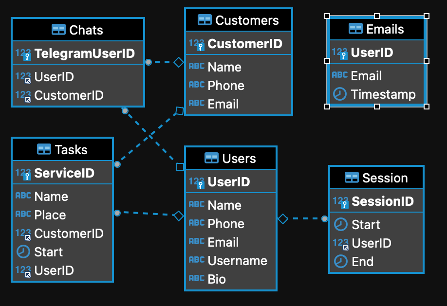

# Secretta Backend

Backend and Middleware of Secretta Application 

## Requirements

- MySQL Database
- mysql.conf file with the following data:

[host]
\
port = <your_MySQL_port>
\
host = "localhost"
\
user = "<your_user>"
\
password = "<your_password>"
\
database = "<your_schema>"

## Initializing

`npm install` 
\
`npm start` 

## User and Task POST Json Format

### Task 

{ \
  "Name": "Tarefa Teste", \
  "Place": "Homeoffice", \
  "CustomerID": 1, \
  "Start": "2022-04-19T01:22:22.000Z", \
  "ServiceID": 4, \
  "UserID": 1 \
}
    
### User

{ \
  "Name":"Usador de Pogramas", \
  "Phone":"11111111111", \
  "Email":"usador@ufrj.br", \
  "Username":"usador", \
  "Bio":"Teste de criação de usuário via CURL" \
}

## Database Schema

